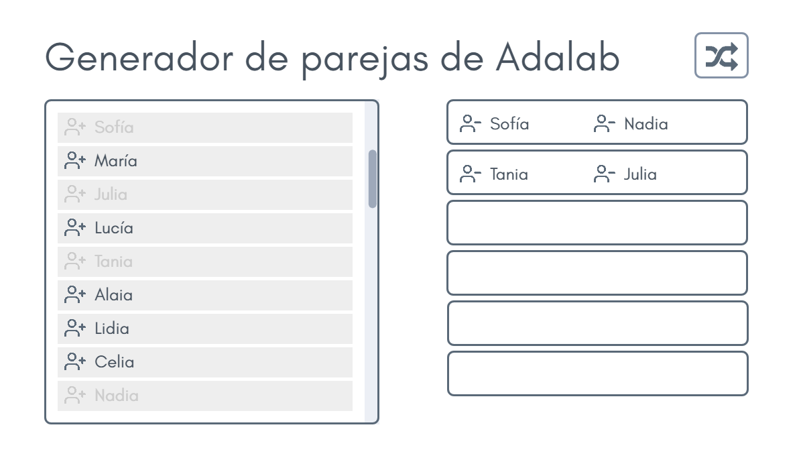

## Fase 1

### 1. Requisitos

En esta primera fase voy a partir de supuesto de que estamos en la segunda semana de curso. La semana pasada ya hubo pair programming. Ahora tengo que generar un listado de parejas aleatorias con una sola condición: **que no se repita ninguna pareja**.

#### Requisitos Funcionales

- Obtener los datos de servidor en modo prueba.
- Generar un listado de parejas aleatorias.
- Comprobar si hay repeticiones.
- En caso de que haya repeticiones volver a generar el listado de parejas aleatoriamente.
- Pintar los resultados en una sencilla tabla que me permita copiarla y pegarla en un spreadsheet de Google. De esta forma aunque el proyecto se quede parado en esta fase durante un tiempo, puedo utilizarlo.

#### Requisitos no funcionales

- La aplicación dispondrá de una interfaz gráfica sencilla e intuitiva para que la interacción de los usuarios sea lo más fácil posible.
- La interfaz mostrará mensajes de error si los contenidos o las respuestas del servidor son erróneas.
- El idioma disponible en el sistema será únicamente el castellano.
- Se podrá utilizar la aplicación en cualquier navegador moderno.

### 2. Prototipo

El diseño de la interfaz de usuario se ha realizado con el objetivo de que sea lo más intuitiva posible con la aplicación, es decir, se ha realizado un diseño centrado en el usuario. Los principios fundamentales por los que se ha guiado el diseño son los siguientes: familiaridad del usuario, consistencia, mínima sorpresa y recuperabilidad.

Para el prototipado se usó la herramienta [Marvel APP](https://marvelapp.com/), aunque se puede utilizar cualquiera que nos sea más cómoda como el .

A continuación se muestra la pantalla en el siguiente enlace con el [Prototipo en vivo](https://marvelapp.com/d951i97).

### 3. Planificación

Cuando estamos haciendo un proyecto personal, debemos establecer hitos para ir trabajando en el proyecto. Estos hitos se plantean teniendo en cuenta nuestra disponibilidad de tiempo, al ser un proyecto personal podemos ir trabajando en el poco a poco e ir dividendo el proyecto en sprints donde cada vez obtenga una pequeña funcionalidad.

En esta primera fase el objetivo es crear la web en HTML Y CSS.

Tareas de la fase 1: https://github.com/Adalab/ejemplo-de-proyecto-personal/projects/1

### 4. Implementación y desarrollo

Implementar tu solución y para ello se necesita:

- Un fetch para coger los datos de un servidor fake.
- Manejo de arrays para generar las parejas aleatorias y comparar con las parejas de la semana anterior.
- Un poco de maquetación.

### 5. Feedback y valoración

Para saber si he cumplido mi objetivo voy a:

- Probar la aplicación con datos de entrada correctos.
- Probar la aplicación con datos de entrada incorrectos, como por ejemplo, con parejas ya repetidas en la semana 1.
- Voy a enseñárselo a la otra profesora de Adalab para que me dé feedback.
